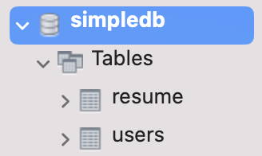
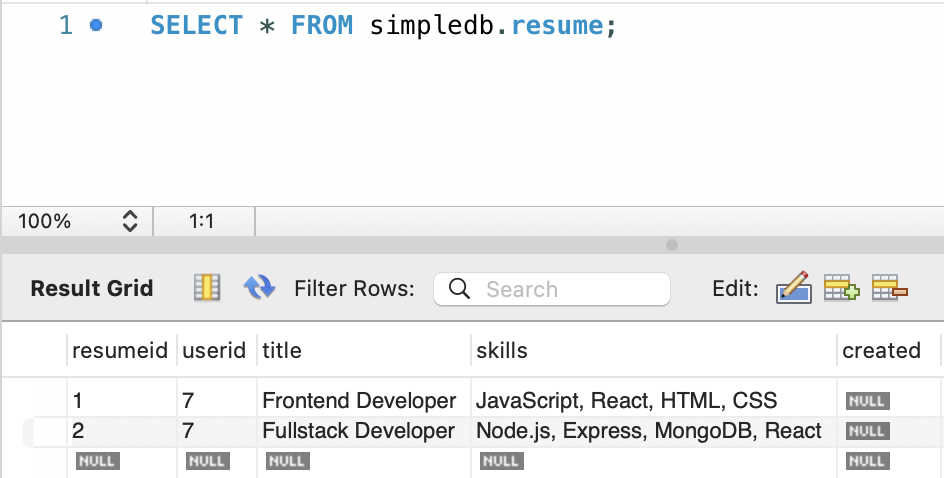
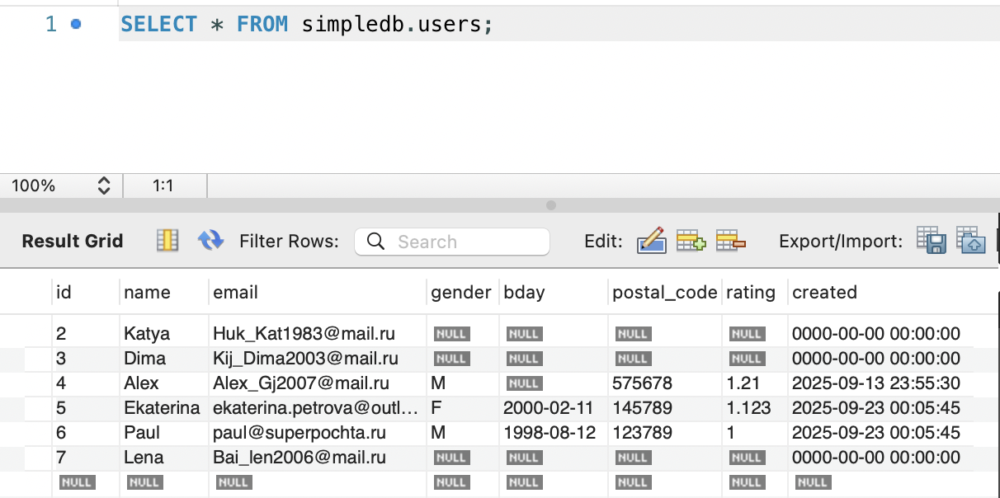

# Портфолио выполненный работ за 4 семестр
---
## Сертификат Stepic

----

## Задание №1. Начало работы с MySQL. MySQL Workbench

[Ссылка на отчёт](https://github.com/lenolium3006/BD_EXAM/blob/main/report_laba/Лабораторная%20работа%201.pdf)

Суть работы:
Освоение базовых приёмов работы в СУБД MySQL через графический инструмент MySQL Workbench. В ходе работы были выполнены: установка и проверка подключения к серверу, создание базы данных simpledb, проектирование и модификация таблицы users с использованием различных типов данных (INT, VARCHAR, ENUM, DATE, FLOAT, TIMESTAMP), изучение автоматического заполнения поля created через CURRENT_TIMESTAMP(). Создана связанная таблица resume с внешним ключом на users, настроены каскадные действия ON DELETE CASCADE и ON UPDATE CASCADE. Проведены эксперименты по вставке, обновлению и удалению данных, включая попытку нарушения ссылочной целостности. Выполнен экспорт SQL-скриптов для добавления записей.

Итог работы:
Закреплены навыки работы с MySQL Workbench: создание схем, таблиц, использование визуального конструктора и редактора SQL. Изучено поведение внешних ключей с каскадными обновлениями и удалениями, а также реакция СУБД на попытки вставки несуществующих ссылок. Получены практические навыки работы с типами данных, автоматическими временными метками и экспортом данных в SQL-файлы.

Скриншот-отчёт о создание базы данных:

---

## Лабораторная работа №2. Схема данных. EER-диаграмма

Суть работы:
Освоение визуального проектирования баз данных в MySQL Workbench через EER-диаграммы. Изучены типы связей (1:1, 1:N, N:M), идентифицирующие и неидентифицирующие отношения, понятия первичного и внешнего ключей, составных ключей. Выполнено прямое инжиниринг (Forward Engineer) для создания физической БД на сервере. Проверено поведение ограничений внешних ключей при удалении записей.

Итог работы:
Созданы две EER-модели: первая — по примеру из ролика (таблицы user, product, invoice), вторая — по статье на Habr (таблицы users, shops, products, orders, deliveries, reviews, gifts) с учётом исправлений опечаток. Обе модели экспортированы в изображения и SQL-скрипты, выполнена генерация БД на сервере. Протестированы каскадные действия: при удалении shops или users — блокировка (NO ACTION), при удалении products — автоматическое удаление связанных orders (CASCADE).

Скриншот-отчёт:
[Ссылка на отчёт](https://github.com/lenolium3006/BD_EXAM/blob/main/report_laba/Лабораторная%20работа%201.pdf)
