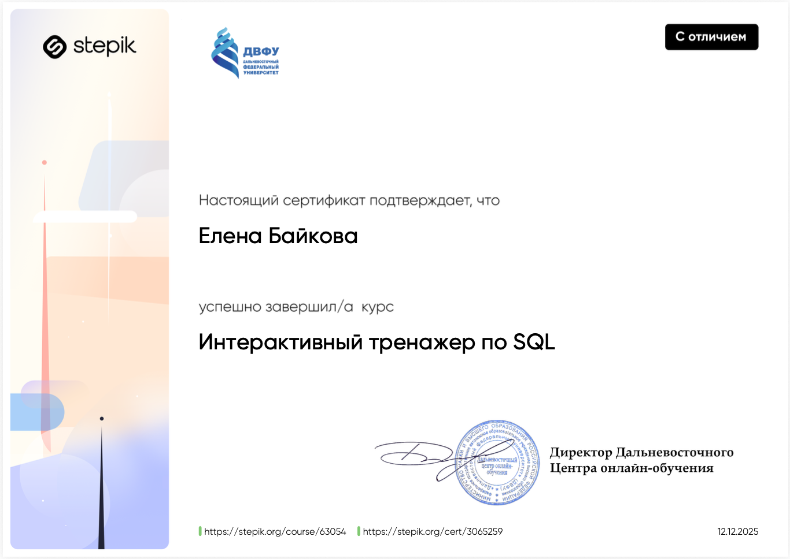

# Портфолио выполненный работ за 4 семестр
---
## Сертификат Stepic

----

## Задание №1. Начало работы с MySQL. MySQL Workbench

[Ссылка на отчёт](image/1.png)

Суть работы:
Освоение базовых приёмов работы в СУБД MySQL через графический инструмент MySQL Workbench. В ходе работы были выполнены: установка и проверка подключения к серверу, создание базы данных simpledb, проектирование и модификация таблицы users с использованием различных типов данных (INT, VARCHAR, ENUM, DATE, FLOAT, TIMESTAMP), изучение автоматического заполнения поля created через CURRENT_TIMESTAMP(). Создана связанная таблица resume с внешним ключом на users, настроены каскадные действия ON DELETE CASCADE и ON UPDATE CASCADE. Проведены эксперименты по вставке, обновлению и удалению данных, включая попытку нарушения ссылочной целостности. Выполнен экспорт SQL-скриптов для добавления записей.

Итог работы:
Закреплены навыки работы с MySQL Workbench: создание схем, таблиц, использование визуального конструктора и редактора SQL. Изучено поведение внешних ключей с каскадными обновлениями и удалениями, а также реакция СУБД на попытки вставки несуществующих ссылок. Получены практические навыки работы с типами данных, автоматическими временными метками и экспортом данных в SQL-файлы.

Выполненные задания :

Задание 1 – Описано назначение разделов Management, Instance, Performance в MySQL Workbench (Server Status, Startup/Shutdown, User Management, Performance Dashboard и др.).
Задание 2 – Создана база данных simpledb с кодировкой utf8 и сопоставлением utf8_general_ci.
Задание 3 – Создана таблица users с полями id (AI, PK), name, email (UNIQUE). Получен и вставлен в отчёт SQL-запрос CREATE TABLE.
Задание 4 – В таблицу users добавлены 3 записи через ручной ввод (Result Grid) и соответствующие SQL-запросы INSERT сохранены в отчёте. Выполнено обновление полей у одной записи, получен SQL-запрос UPDATE.
Задание 5 – Таблица users модифицирована: добавлены поля gender (ENUM), bday (DATE), postal_code (VARCHAR), rating (FLOAT), created (TIMESTAMP с CURRENT_TIMESTAMP()). Изменён размер name до VARCHAR(50). Описано значение поля created и определены поля, допускающие NULL. Получен SQL-запрос ALTER TABLE.
Задание 6 – Дополнительно вставлены записи через SQL-запросы (для Ekaterina и Paul).
Задание 7 – Экспортирован файл .sql со всеми INSERT-запросами, проанализирован синтаксис.
Задание 8 – Создана таблица resume с полями: resumeid (PK, AI), userid (INT, NN), title (VARCHAR), skills (TEXT), created (TIMESTAMP). Настроен внешний ключ на users.id с параметрами ON DELETE CASCADE и ON UPDATE CASCADE. Получен SQL-запрос CREATE TABLE, описано поведение каскадов.
Задание 9 – Таблица resume наполнена данными для нескольких пользователей (от 1 до 3 резюме). Выполнен экспорт .sql-файла. Произведена попытка вставить запись с несуществующим userid=55 – получена ошибка ERROR 1452 из-за нарушения внешнего ключа.
Задание 10 – Удалены записи из resume (для проверки каскадных эффектов). Проверено каскадное удаление: при удалении пользователя из users автоматически удаляются его резюме. Проверено каскадное обновление: при изменении id пользователя в users – userid в resume обновляется автоматически (скриншот прилагается).