# Портфолио выполненный работ за 4 семестр
---
## Сертификат Stepic

----

## Задание №1. Начало работы с MySQL. MySQL Workbench

[Ссылка на отчёт](https://github.com/lenolium3006/BD_EXAM/blob/main/report_laba/Лабораторная%20работа%201.pdf)

Суть работы:
Освоение базовых приёмов работы в СУБД MySQL через графический инструмент MySQL Workbench. В ходе работы были выполнены: установка и проверка подключения к серверу, создание базы данных simpledb, проектирование и модификация таблицы users с использованием различных типов данных (INT, VARCHAR, ENUM, DATE, FLOAT, TIMESTAMP), изучение автоматического заполнения поля created через CURRENT_TIMESTAMP(). Создана связанная таблица resume с внешним ключом на users, настроены каскадные действия ON DELETE CASCADE и ON UPDATE CASCADE. Проведены эксперименты по вставке, обновлению и удалению данных, включая попытку нарушения ссылочной целостности. Выполнен экспорт SQL-скриптов для добавления записей.

Итог работы:
Закреплены навыки работы с MySQL Workbench: создание схем, таблиц, использование визуального конструктора и редактора SQL. Изучено поведение внешних ключей с каскадными обновлениями и удалениями, а также реакция СУБД на попытки вставки несуществующих ссылок. Получены практические навыки работы с типами данных, автоматическими временными метками и экспортом данных в SQL-файлы.

Скриншот-отчёт о создание базы данных:

---

## Задание №2. Схема данных. EER-диаграмма

[Ссылка на отчёт](https://github.com/lenolium3006/BD_EXAM/blob/main/report_laba/Лабораторная%20работа%202%20по%20базам%20данных.pdf)

Суть работы:
Освоение визуального проектирования баз данных в MySQL Workbench через EER-диаграммы. Изучены типы связей (1:1, 1:N, N:M), идентифицирующие и неидентифицирующие отношения, понятия первичного и внешнего ключей, составных ключей. Выполнено прямое инжиниринг (Forward Engineer) для создания физической БД на сервере. Проверено поведение ограничений внешних ключей при удалении записей.

Итог работы:
Созданы две EER-модели: первая — по примеру из ролика (таблицы user, product, invoice), вторая — по статье на Habr (таблицы users, shops, products, orders, deliveries, reviews, gifts) с учётом исправлений опечаток. Обе модели экспортированы в изображения и SQL-скрипты, выполнена генерация БД на сервере. Протестированы каскадные действия: при удалении shops или users — блокировка (NO ACTION), при удалении products — автоматическое удаление связанных orders (CASCADE).

Скриншот-отчёт:

Задание 1

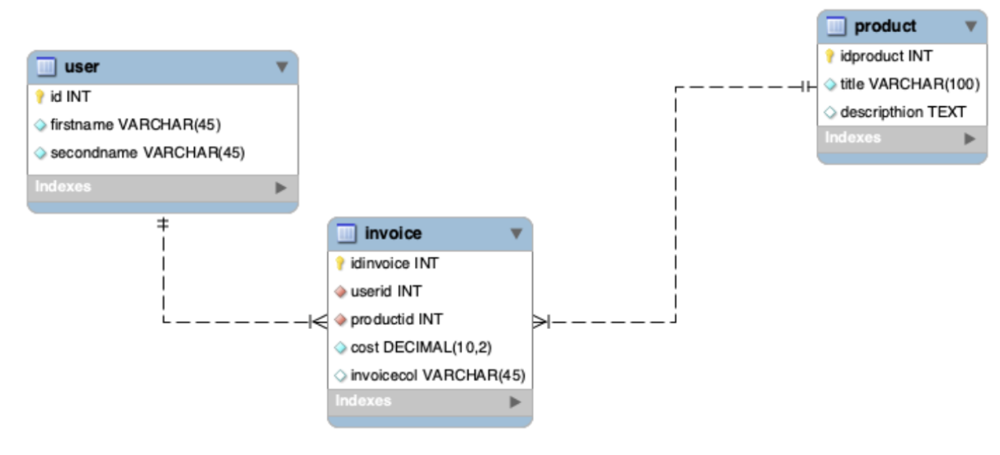

Задание 2

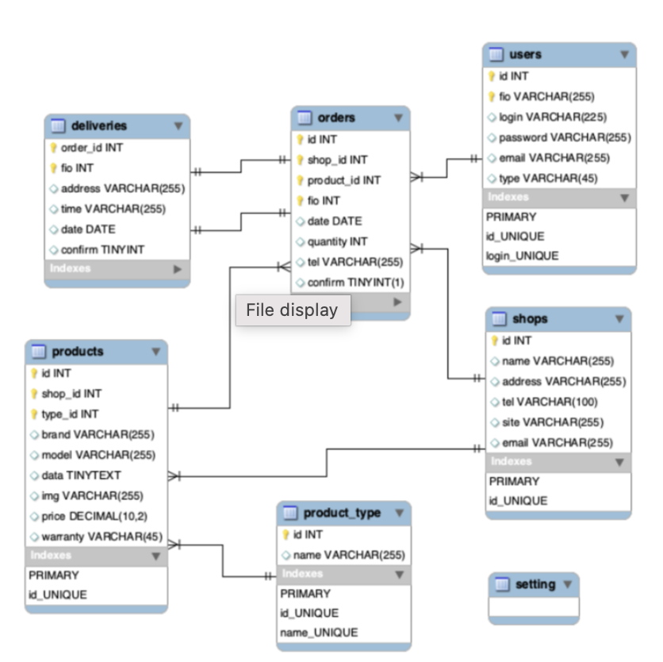

Задание 3

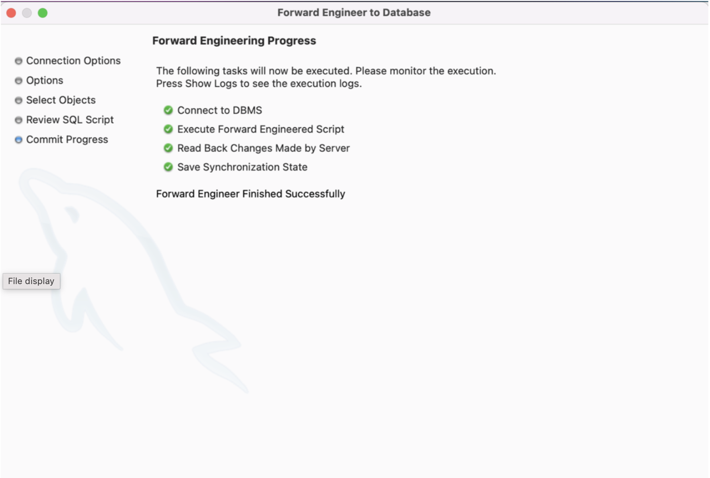

---

## Задание №3. 

[Ссылка на таблицу](https://docs.google.com/spreadsheets/d/1hIBWoaCrAl0t22_Wr1oDEq0dFOQeyw6ncXsqRk88Zf0/edit?gid=0#gid=0)

Суть работы:
Закрепление теоретических знаний и практических навыков работы с реляционной алгеброй на примере предметной области «Магазин игр с доставкой». В ходе работы были сформулированы запросы к существующей базе данных с использованием операций реляционной алгебры (выборка, проекция, соединение, деление и др.) для получения конкретных ответов на три поставленные задачи. Также выполнена практическая проверка запросов на реальных данных (или смоделирована вручную) с оформлением результатов в Google‑документе.

Итог работы:
Освоены основные операции реляционной алгебры, необходимые для извлечения информации из связанных таблиц. Получены ответы на все три задачи:

Определены адреса клиентов, заказывавших игры с доставкой.
Найдены название и производитель игры(р), в которую можно играть самой большой компанией (по выбранному критерию).
Выявлен табельный номер сотрудника, ответственного ровно за один заказ на текущий момент.
Решения оформлены в виде последовательности алгебраических выражений, проверены на корректность и сохранены в общем документе с открытым доступом для комментирования (ссылка прилагается).

Скриншот-отчёт:

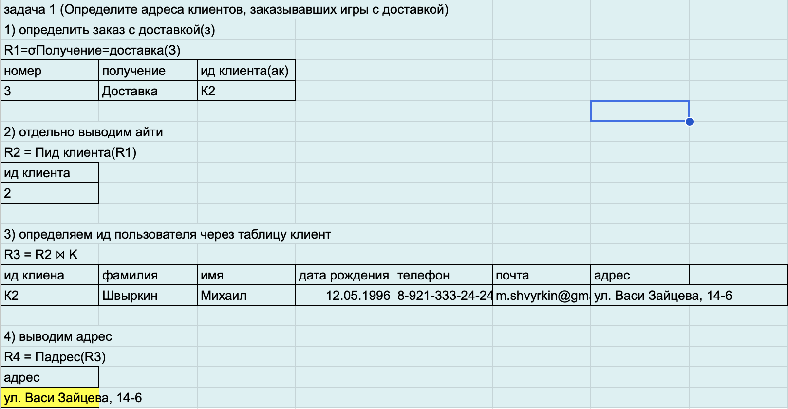
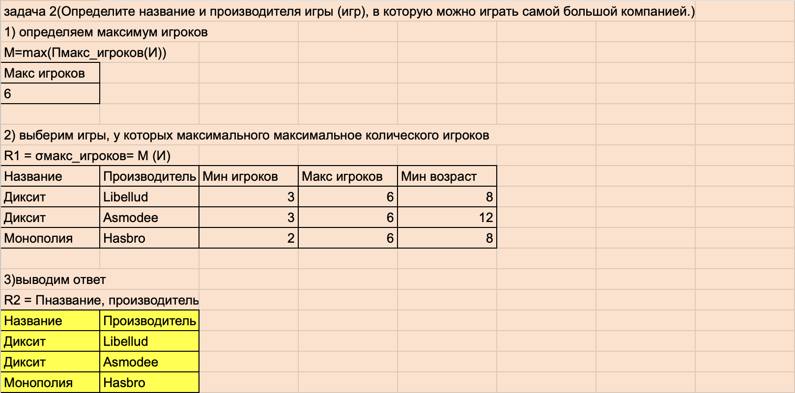
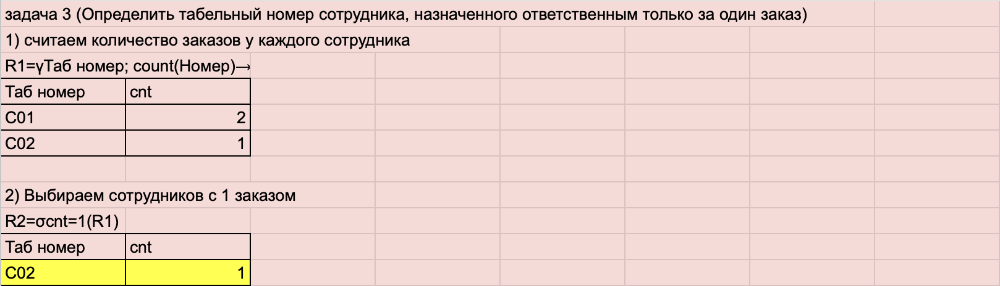

---

## Задание №4. 

Суть работы:
Продолжение освоения реляционной алгебры на примере предметной области «Магазин игр» (или аналогичной). В ходе работы были сформулированы и проверены три запроса к базе данных с использованием операций выборки, проекции, соединения, группировки и агрегации. Каждый запрос решает конкретную задачу по извлечению информации о клиентах, заказах, играх и сотрудниках. Результаты оформлены в Google-документе с пошаговым ходом решения.

Итог работы:
Закреплены навыки построения сложных запросов на реляционной алгебре с учётом условий на количество позиций в заказе, возрастных ограничений и диапазонов количества игроков. Получены ответы на все три задачи:

Найдены имена и телефоны клиентов, у которых в одном заказе присутствуют не менее двух игр с разными названиями.
Определён табельный номер сотрудника, оформившего заказ, включающий игру с минимальным возрастом игроков 12 лет.
Выявлены фамилии и имена клиентов, купивших игры с минимальным количеством игроков от 2 до 6.
Решения представлены в виде выражений реляционной алгебры, проверены на корректность и сохранены в общем документе с открытым доступом для комментирования (ссылка прилагается).

Скриншот-отчёт:

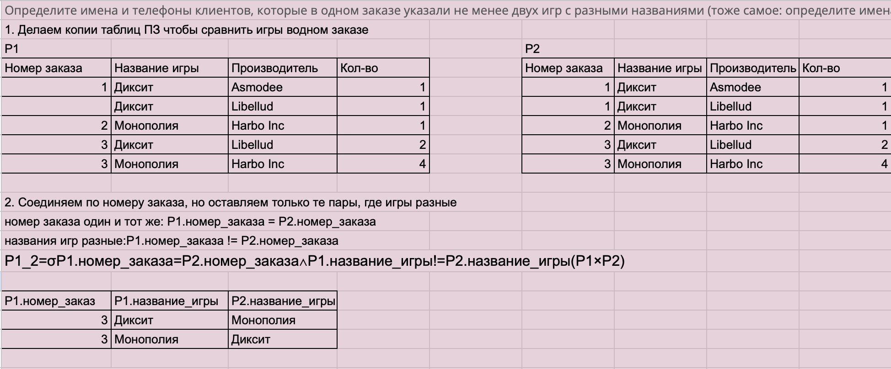

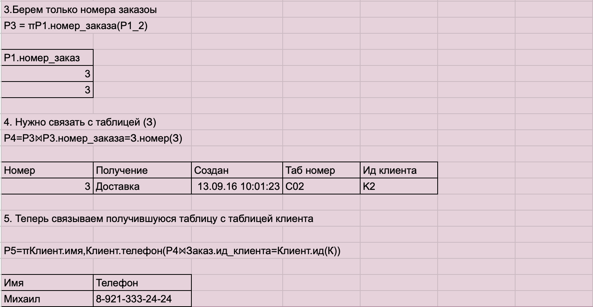

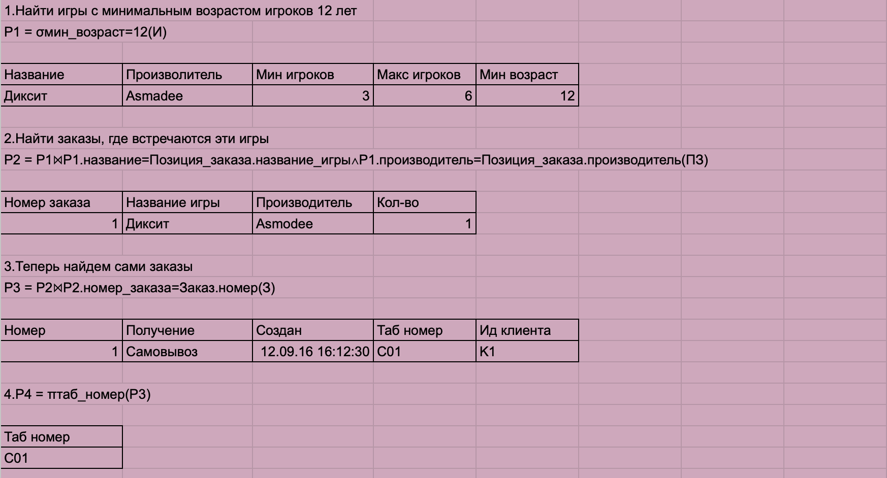

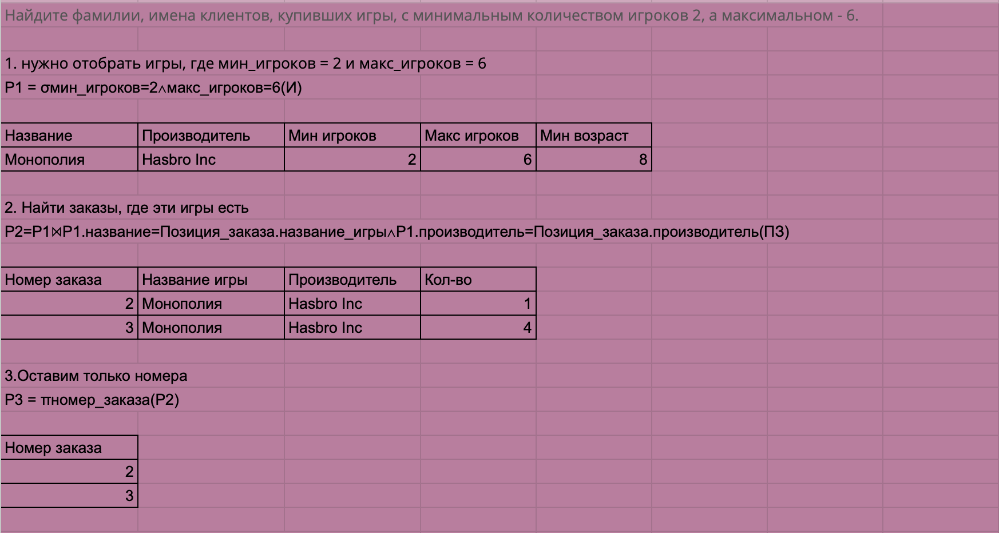

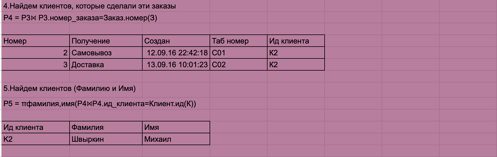

---

## Задание №5.

[Ссылка на отчёт](https://docs.google.com/spreadsheets/d/1hIBWoaCrAl0t22_Wr1oDEq0dFOQeyw6ncXsqRk88Zf0/edit?gid=0#gid=0)

Суть работы:
Проектирование реляционной базы данных для учёта жёстких дисков (HDD) в организации. На основе текстового описания предметной области были выделены все атрибуты, выявлены функциональные зависимости, выполнена нормализация отношения до третьей нормальной формы (ЗНФ) и проверка на соответствие нормальной форме Бойса — Кодда (НФБК). Построена логическая схема БД и сгенерирован SQL-скрипт для физической реализации.

Итог работы:
Разработана нормализованная структура из трёх таблиц: Manufacturers (производители), Models (модели дисков), Disks (экземпляры дисков). Все отношения находятся в НФБК, так как каждый детерминант функциональных зависимостей является первичным ключом. Естественное соединение таблиц восстанавливает исходное отношение без потерь. Созданы SQL-запросы CREATE TABLE с корректными внешними ключами и ограничениями (ON UPDATE CASCADE, ON DELETE RESTRICT). Схема данных реализована в MySQL Workbench.

Скриншот-отчёт:

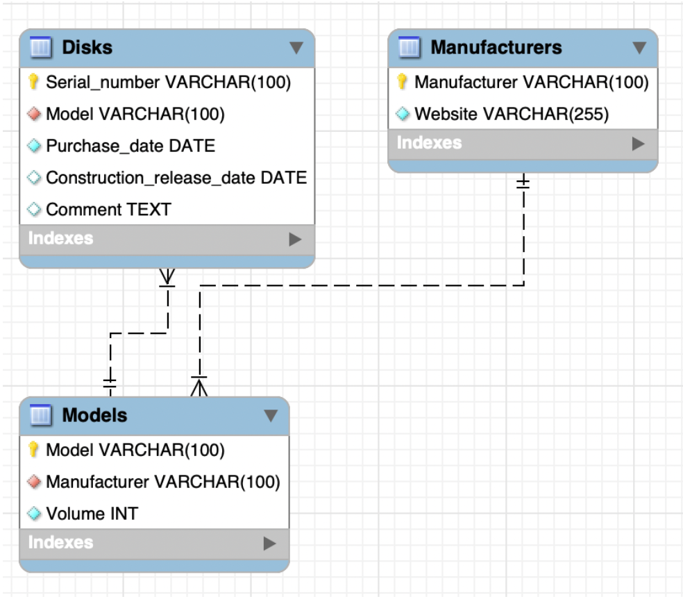

---

## Задание №6.

[Ссылка на отчёт](https://colab.research.google.com/drive/178Kz90W7Y_qZFON2yRHhCoRP_bulbZ0L?authuser=0#scrollTo=8AVGKHi60R8P)

Суть работы:
Выполнение комплекса самостоятельных заданий по курсу «Базы данных», охватывающих теоретические и практические аспекты: архитектура СУБД, модели данных, нормализация, проектирование реляционных БД, работа с SQL и развёртывание СУБД в контейнерах Docker. В ходе работы были изучены типы данных и объекты MySQL, созданы презентации по ведущим производителям и этапам развития СУБД, выполнено развёртывание MongoDB в Docker, спроектирована реляционная модель для предметной области, проведена нормализация до 3НФ на примере магазина спортивных товаров, написаны SQL-запросы для создания и наполнения базы данных.

Итог работы:
Выполнены все четыре самостоятельные работы:

1 – заполнена таблица с типами данных MySQL, созданы две презентации (по производителям и этапам развития СУБД), развёрнута MongoDB в Docker с демонстрацией базовых команд.
2 – предложены предметные области для различных моделей данных, заполнена таблица преимуществ и недостатков моделей.
3 – реализована реляционная модель данных для заданной предметной области с выделением сущностей, связей, потенциальных ключей и условий проверки атрибутов.
4 – спроектирована база данных для магазина спортивных товаров, приведённая к 3НФ, созданы SQL-скрипты для создания таблиц, добавления данных и выполнения запросов.

Скриншот-отчёт:

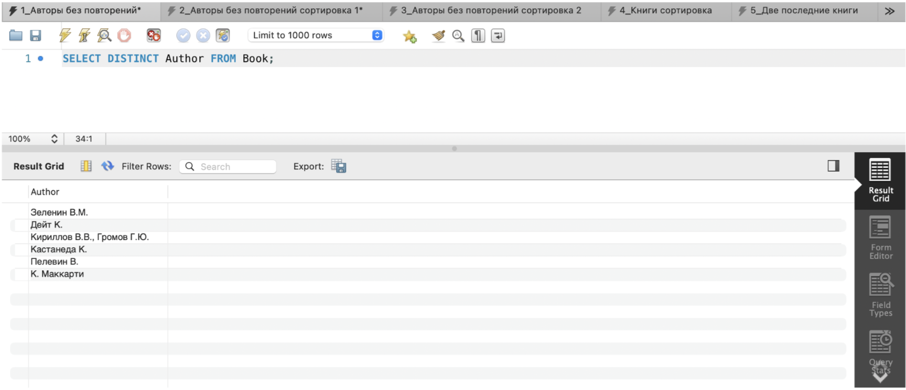
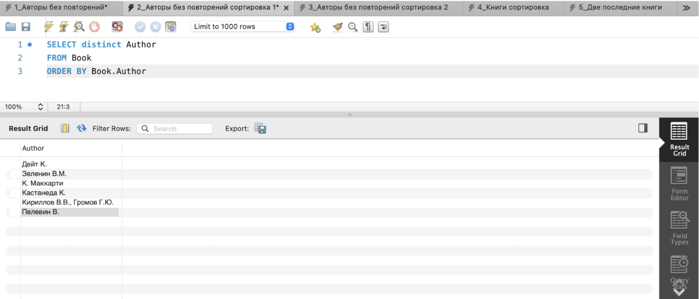
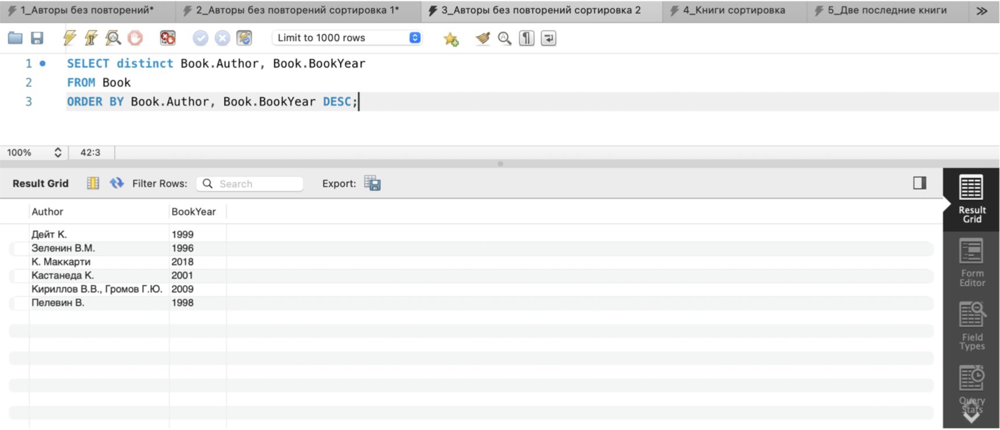
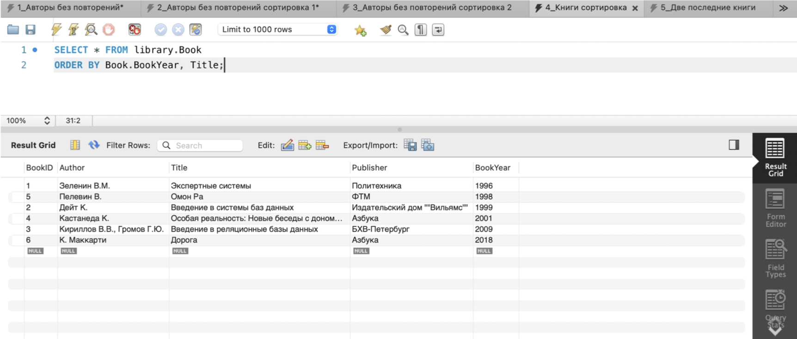
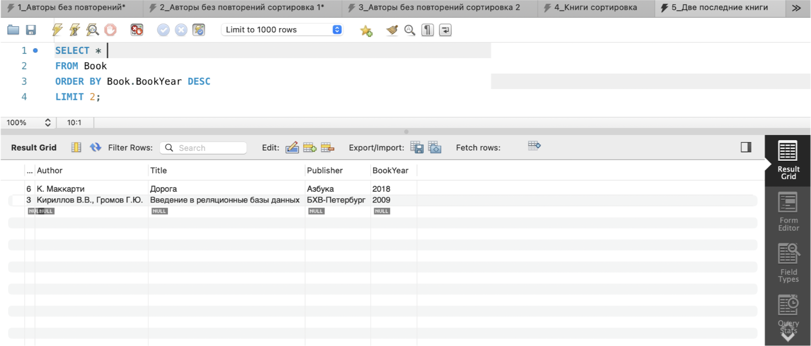
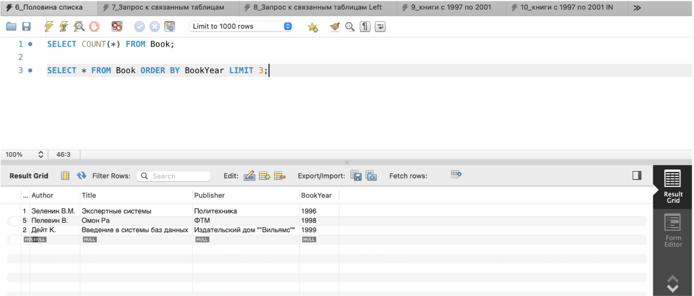
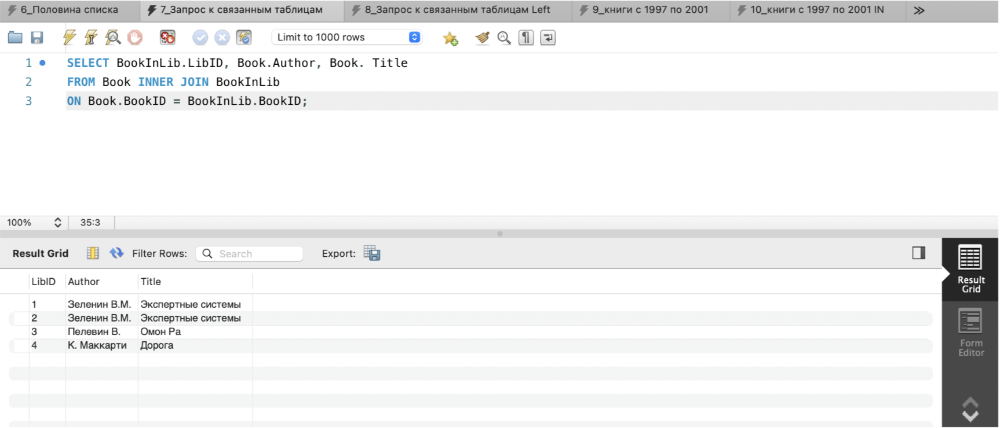
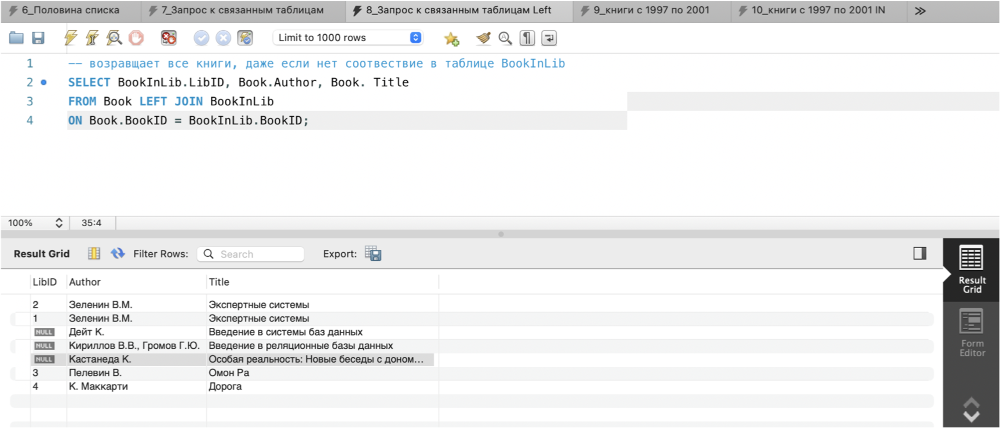
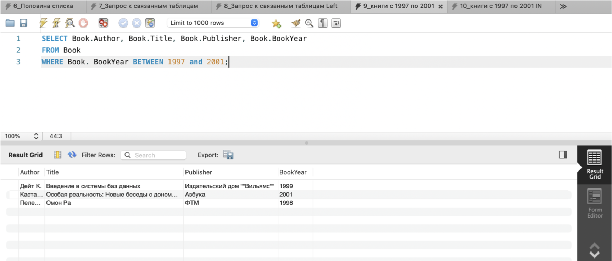
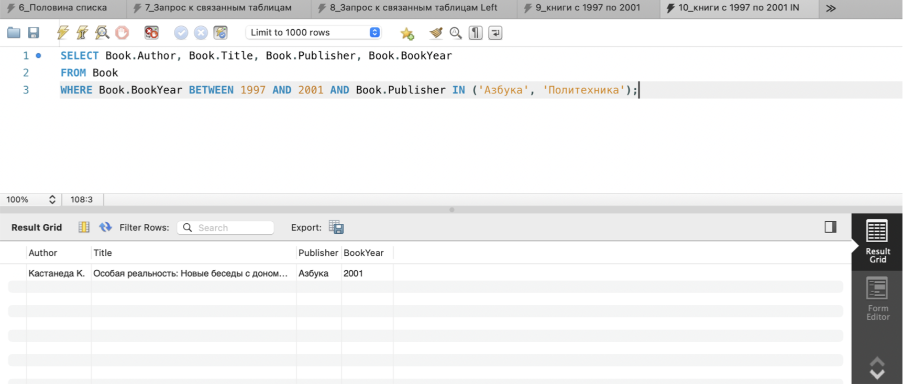
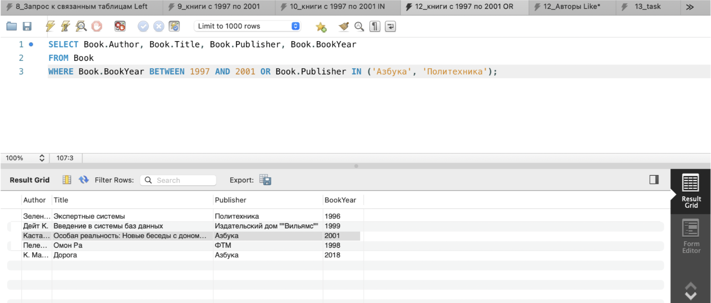
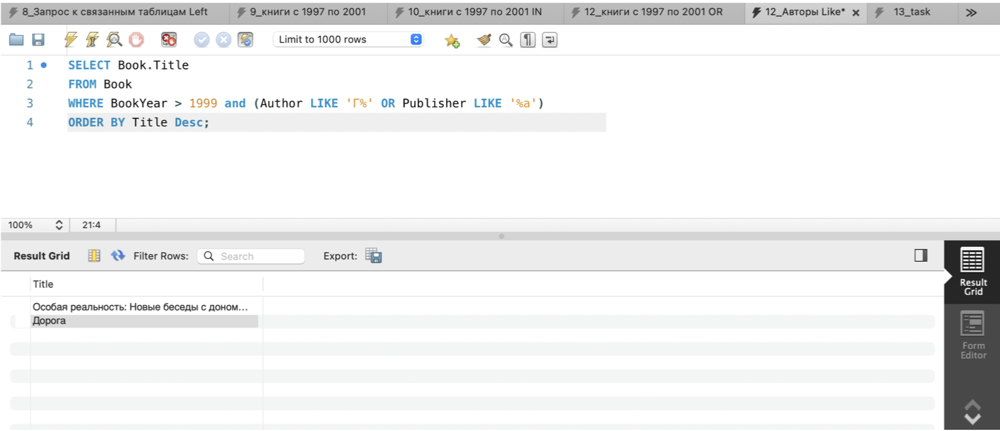
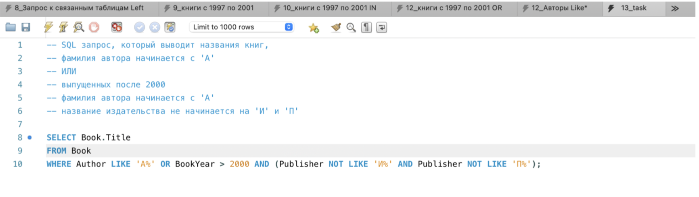

---

## Лабораторная работа №6.

Суть работы

Разработана реляционная модель базы данных для предметной области «Магазин настольных игр». В ходе проектирования выделены ключевые сущности: Игра, Клиент, Сотрудник, Заказ. Определены первичные и альтернативные ключи, наложены ограничения целостности (NOT NULL, CHECK, UNIQUE). Для связи «многие-ко-многим» между заказами и играми создана промежуточная таблица Позиция_заказа (или OrderItem), в которую добавлен атрибут Количество. Установлены внешние ключи, обеспечивающие ссылочную целостность.

Итоги работы

Спроектирована логическая схема, состоящая из 5 таблиц, полностью отражающая бизнес-правила предметной области.
Для каждой таблицы определены потенциальные ключи, обязательные атрибуты и условия проверки значений.
Реализован SQL-скрипт для создания таблиц в СУБД MySQL с учётом всех ограничений (первичные, внешние, альтернативные ключи, CHECK-ограничения).
Выполнено заполнение таблиц тестовыми данными из задания; проверена работоспособность связей и ограничений.
Модель готова к использованию в реальной системе учёта заказов магазина настольных игр.

Скриншот-отчёт:

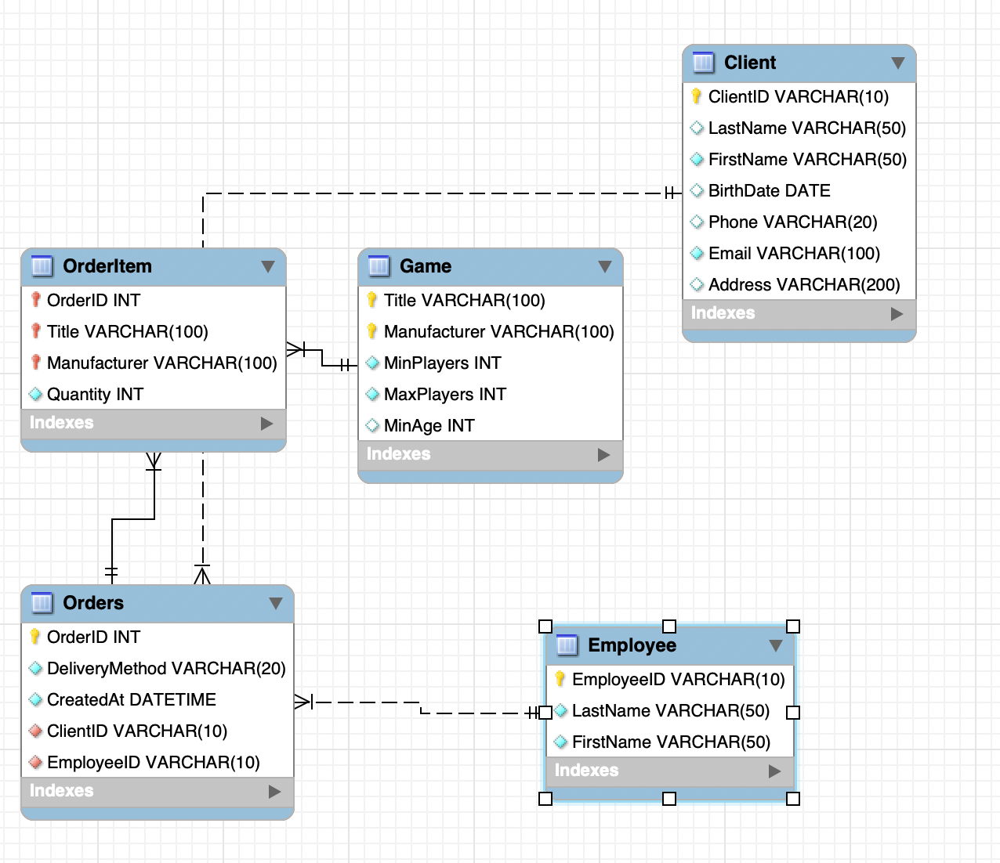
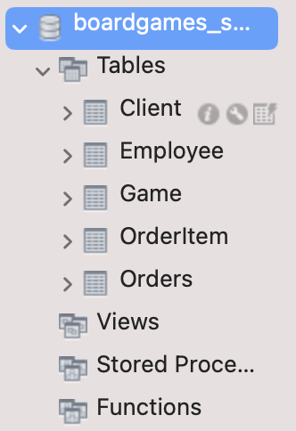